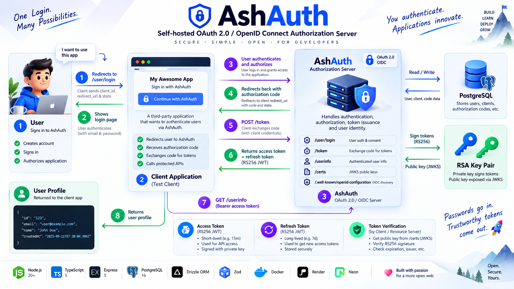
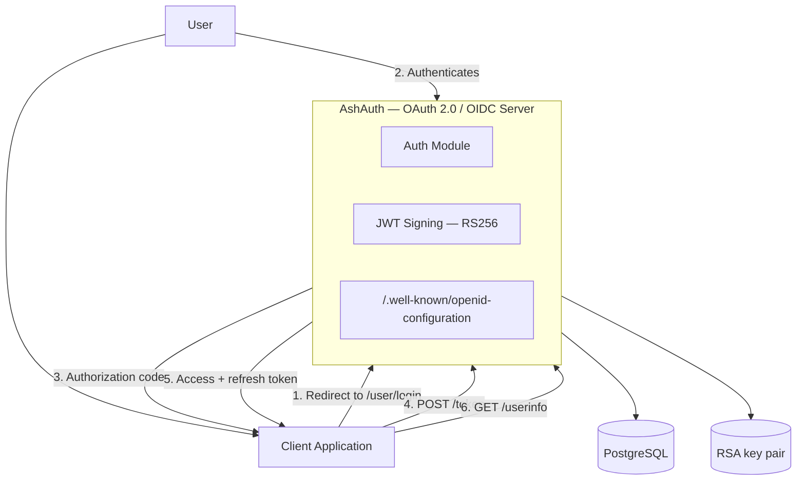
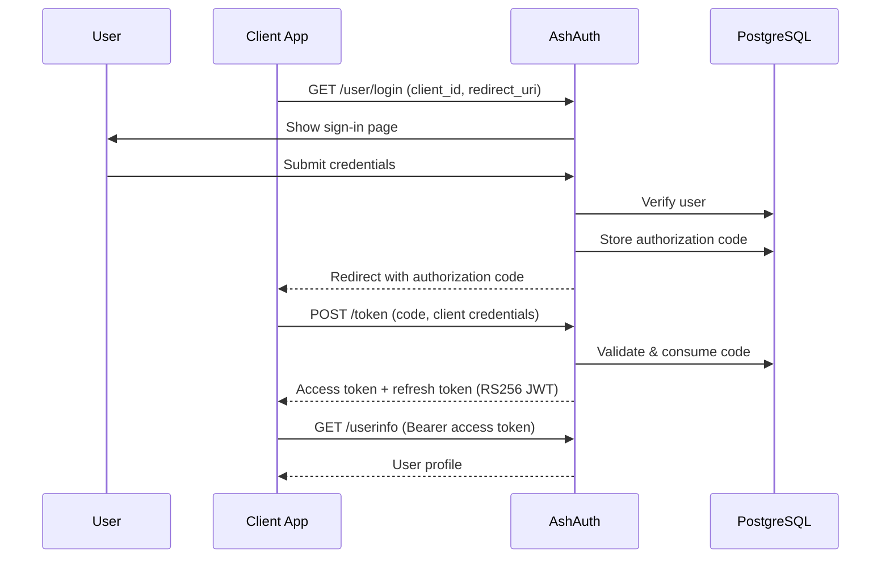

# 🔐 AshAuth

**A self-hosted OAuth 2.0 / OpenID Connect authorization server, built from scratch.**

[](https://nodejs.org)
[](https://www.typescriptlang.org)
[](https://expressjs.com)
[](https://www.postgresql.org)
[](#license)
[](https://ashauth.onrender.com/)

> Authentication is complicated. Understanding it shouldn't be.

AshAuth implements OAuth 2.0 and OpenID Connect end to end — user signup, the authorization code flow, RS256-signed JWTs, and a protected `/userinfo` endpoint — with no libraries hiding the mechanics. It also ships a small dashboard so you can register OAuth clients and try the full flow without writing a relying-party app first.


**Live deployment:** [ashauth.onrender.com](https://ashauth.onrender.com/)

> Hosted on Render's free tier — the first request after inactivity may take a few seconds to spin up.



---

## Table of Contents

- [Features](#-features)
- [Tech Stack](#-tech-stack)
- [Architecture](#-architecture)
- [Authorization Code Flow](#-authorization-code-flow)
- [API Endpoints](#-api-endpoints)
- [Security](#-security)
- [Getting Started](#-getting-started)
- [Project Structure](#-project-structure)
- [Deployment](#-deployment)
- [Project Status](#-project-status)
- [Why AshAuth?](#-why-ashauth)
- [License](#license)

---

## ✨ Features

**Identity & OAuth**

- User signup & signin with bcrypt-hashed passwords
- OAuth 2.0 Authorization Code flow
- OpenID Connect discovery (`/.well-known/openid-configuration`)
- RS256-signed JWT access & refresh tokens
- Protected `/userinfo` endpoint
- JWKS endpoint (`/certs`) for public key discovery

**Developer dashboard**

- Dashboard signup/login for developers, separate from end-user accounts
- Register, update, and delete OAuth client applications
- View registered clients per developer account

**Infrastructure**

- PostgreSQL via Drizzle ORM, with SQL migrations
- Docker Compose for a local PostgreSQL instance
- Server-rendered HTML pages for signup/signin/dashboard/client registration
- Designed for Neon (PostgreSQL) + Render deployment

---

## 🧰 Tech Stack

| Technology           | Purpose                      |
| -------------------- | ---------------------------- |
| Node.js              | Runtime                      |
| TypeScript           | Backend language             |
| Express 5            | HTTP server                  |
| PostgreSQL           | Database                     |
| Drizzle ORM          | Database access & migrations |
| jsonwebtoken (RS256) | Token signing & verification |
| bcryptjs             | Password hashing             |
| Zod                  | Request validation           |
| Docker Compose       | Local PostgreSQL environment |

---

## 🏗️ Architecture



---

## 🔄 Authorization Code Flow



No magic — every step above is implemented in `src/app/module/auth`.

---

## 🔌 API Endpoints

| Method | Endpoint                            | Auth   | Purpose                                      |
| ------ | ----------------------------------- | ------ | -------------------------------------------- |
| GET    | `/.well-known/openid-configuration` | —      | OIDC discovery document                      |
| GET    | `/certs`                            | —      | JWKS / public signing keys                   |
| GET    | `/user/register`                    | —      | Render signup page                           |
| POST   | `/user/register`                    | —      | Create a user account                        |
| GET    | `/user/login`                       | —      | Render login page                            |
| POST   | `/user/login`                       | —      | Authenticate user, issue authorization code  |
| POST   | `/token`                            | —      | Exchange authorization code for tokens       |
| GET    | `/userinfo`                         | Bearer | Return the authenticated user's profile      |
| GET    | `/dashboard`                        | —      | Developer dashboard page                     |
| POST   | `/dashboard/signup`                 | —      | Create a developer account                   |
| POST   | `/dashboard/login`                  | —      | Authenticate a developer                     |
| GET    | `/client/register`                  | —      | Render OAuth client registration page        |
| POST   | `/client/register`                  | Bearer | Register a new OAuth client                  |
| GET    | `/clients`                          | Bearer | List OAuth clients for the current developer |
| GET    | `/client/meta`                      | —      | Fetch public client metadata                 |
| PUT    | `/client/:clientId`                 | Bearer | Update an OAuth client                       |
| DELETE | `/client/:clientId`                 | Bearer | Delete an OAuth client                       |

---

## 🔒 Security

- Passwords hashed with **bcrypt**
- Tokens signed with **RS256** using an asymmetric RSA key pair (`cert/`)
- Short-lived access tokens + longer-lived refresh tokens (configurable expiry)
- Authorization codes are single-use and validated server-side before token exchange
- Secrets and database credentials are supplied via environment variables

> 🔐 Private keys and `.env` files should never be committed to Git.

---

## 🚀 Getting Started

### 1. Clone

```bash
git clone https://github.com/Ashishjha013/ashauth.git
cd ashauth
```

### 2. Install dependencies

```bash
npm install
```

### 3. Configure environment variables

Copy `env_sample.txt` to `.env` and fill in real values:

```bash
cp env_sample.txt .env
```

```env
PORT=8080
DATABASE_URL=your_database_url
MIGRATION_DATABASE_URL=your_migration_database_url

ACCESS_TOKEN_SECRET=your_access_token_secret
REFRESH_TOKEN_SECRET=your_refresh_token_secret

ACCESS_TOKEN_EXPIRY=15m
REFRESH_TOKEN_EXPIRY=7d
```

### 4. Start a local PostgreSQL instance (optional)

```bash
docker compose up -d
```

### 5. Generate RSA signing keys

```bash
./generate-keys.sh
```

This creates `cert/private.pem` and `cert/public.pem`, used to sign and verify JWTs.

### 6. Run database migrations

```bash
npm run db:migrate
```

### 7. Start the development server

```bash
npm run dev
```

AshAuth will be available at **http://localhost:8080**.

---

## 📁 Project Structure

```text
ashauth/
├── cert/                        # RSA key pair (not committed)
├── drizzle/                     # Generated SQL migrations
├── public/                      # Server-rendered pages (landing, signin, signup, dashboard)
├── src/
│   ├── app/
│   │   ├── app.ts               # Express app & middleware setup
│   │   ├── common/utils/        # Shared utilities (JWT, API responses/errors)
│   │   └── module/auth/         # Auth domain: routes, controllers, services, middleware
│   ├── db/
│   │   ├── config.ts            # Database connection
│   │   └── schema.ts            # Drizzle schema (users, oauth_clients, authorization_codes)
│   └── index.ts                 # Server entry point
├── docker-compose.yml           # Local PostgreSQL
├── drizzle.config.js
├── generate-keys.sh             # RSA key pair generation
├── env_sample.txt
└── package.json
```

---

## 🌐 Deployment

AshAuth runs in production at **[ashauth.onrender.com](https://ashauth.onrender.com/)**, deployed on:

- **[Render](https://render.com)** — application hosting
- **[Neon](https://neon.tech)** — serverless PostgreSQL

The same authorization code flow, JWT signing, and migrations run identically in production and locally — only the environment variables change.

---

## 📌 Project Status

Core OAuth 2.0 / OIDC flow — signup, login, authorization code, token exchange, `/userinfo` — is **working end to end**, along with a developer dashboard for managing OAuth clients.

Actively evolving: standards compliance, additional test coverage, and developer-experience improvements.

---

## 🤝 Why AshAuth?

Because the best way to understand authentication is to build it.

Instead of pulling in an auth library, this project implements the pieces underneath it:

```
Passwords → Users → Authorization → Codes → Tokens → UserInfo
```

Passwords go in. Trustworthy tokens come out.

---

## License

ISC — see [`package.json`](./package.json).
